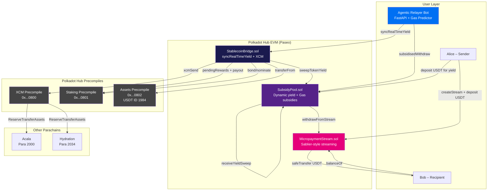

# Zero-Fee Micropayments on Polkadot Hub

> **DoraHacks / OpenGuild Hackathon · Track 2: PVM/Native Functionality**
> Testnet: Polkadot Hub Paseo

Stream ERC-20 stablecoins (USDT / USDC) continuously on Polkadot Hub with **zero gas fees for recipients** — gas costs are entirely covered by **live staking yield** from the Staking Precompile (0x801), ad-slot revenue, and SubsidyPool depositors. Native Asset ID 1984 (USDT) supported via Assets Precompile (0x802).

---

## Architecture Diagram



---

## Project Structure

```
zero-fee-micropayments/
├── backend/
│   ├── contracts/
│   │   ├── MicropaymentStream.sol   # Sablier-style streaming with subsidy hooks
│   │   ├── SubsidyPool.sol          # Dynamic yield pool (staking + ads + gas subsidies)
│   │   ├── StablecoinBridge.sol     # syncRealTimeYield + XCM precompile bridge
│   │   └── MockERC20.sol            # Test token (local only)
│   ├── scripts/
│   │   └── deploy.ts                # Native Asset ID 1984 aware deployment
│   ├── test/
│   │   └── MicropaymentStream.test.ts
│   ├── hardhat.config.ts
│   └── package.json
├── frontend/
│   ├── src/
│   │   ├── App.tsx                   # 5-tab layout (Streams, Yield Pool, Yield Engine, Bridge, History)
│   │   ├── config/
│   │   │   ├── wagmi.ts             # Paseo chain definition
│   │   │   └── contracts.ts         # ABIs + precompile addresses
│   │   ├── components/
│   │   │   ├── WalletConnect.tsx
│   │   │   ├── StreamForm.tsx
│   │   │   ├── Dashboard.tsx        # + Live Stream Visualizer (Framer Motion)
│   │   │   ├── SubsidyPoolStatus.tsx # Real-time APY + Gas Saved USD tracker
│   │   │   ├── YieldEngine.tsx      # TVL vs Gas Saved analytics dashboard
│   │   │   ├── BridgeButton.tsx
│   │   │   └── TransactionHistory.tsx
│   │   ├── hooks/
│   │   │   └── useStream.ts
│   │   ├── main.tsx
│   │   └── index.css
│   └── package.json
├── relayer/
│   ├── main.py                       # FastAPI agentic relayer service
│   ├── relayer.py                    # Core relayer logic + event monitoring
│   ├── gas_predictor.py              # ML-based gas price prediction model
│   ├── abis.py                       # Contract ABIs for web3.py
│   ├── config.py                     # Environment configuration
│   ├── requirements.txt
│   └── .env.example
└── README.md
```

---

## Technical Stack

| Layer           | Technology                                                   |
| --------------- | ------------------------------------------------------------ |
| Smart Contracts | Solidity ^0.8.20, OpenZeppelin 5.x, Custom Errors            |
| Development     | Hardhat 2.22, TypeScript, Ethers v6                          |
| Testing         | Mocha, Chai, hardhat-network-helpers                         |
| Frontend        | React 18, Vite 5, TypeScript                                 |
| Web3            | Wagmi v2, Viem v2, RainbowKit v2                             |
| State           | TanStack Query v5                                            |
| Styling         | Tailwind CSS 3.4, Framer Motion                              |
| Relayer         | Python 3.11+, FastAPI, web3.py, numpy                        |
| Network         | Polkadot Hub Paseo testnet (EVM)                             |
| Precompiles     | XCM (0x800), Staking (0x801), Assets (0x802)                 |
| Native Assets   | USDT (Asset ID 1984), USDC (Asset ID 1337) via 0x802        |

---

---

## Track 2 Compliance (DoraHacks / OpenGuild)

| Requirement | Implementation |
| ----------- | -------------- |
| **Native Asset ID (0x802)** | Uses Asset ID **1984** (USDT) and **1337** (USDC) via Assets Precompile `0x0000...0802`. `bridgeAssetToParachain()` and deployment script use native Substrate assets. |
| **Staking Precompile (0x801)** | `StablecoinBridge.syncRealTimeYield()` calls `pendingRewards()` and `payout()` on `0x0000...0801`. Yield flows into SubsidyPool to subsidise gas. |
| **XCM Cross-Chain (0x800)** | `bridgeToParachain()` / `bridgeAssetToParachain()` use XCM Precompile `0x0000...0800` for `xcmSend()` to parachains (e.g. Acala 2000, Hydration 2034). `_encodeParachainDest()` SCALE-encodes multilocations for Paseo. |

---

## Key Features (Track 2 — PVM/Native Functionality)

### 1. Live Staking Interoperability
- `StablecoinBridge.syncRealTimeYield()` queries the **Staking Precompile (0x801)** for `pendingRewards()`, triggers `payout()`, and sweeps rewards into the SubsidyPool
- Dynamic APY replaces the hardcoded 5% yield — real validator rewards power the subsidy layer
- `getStakingStats()` view exposes live bonded amount, pending rewards, and sweep history

### 2. Native Asset Support
- Deployment script uses **Native USDT (Asset ID 1984)** via the **Assets Precompile (0x802)** on Paseo
- `bridgeAssetToParachain()` uses `ASSETS_PRECOMPILE.transferFrom()` instead of ERC-20 wrappers
- Fallback to MockERC20 on local networks for testing

### 3. Agentic Relayer Bot
- Python/FastAPI service that monitors `MicropaymentStream` events
- **Gas Predictor** uses exponentially-weighted sliding window statistics to find optimal gas windows
- Automatically calls `SubsidyPool.subsidisedWithdraw()` at low-gas moments
- Periodically triggers `syncRealTimeYield()` to keep staking rewards flowing

### 4. Yield Engine Analytics
- Real-time TVL vs Gas Saved dashboard
- Staking Precompile (0x801) deep dive with bonded DOT, pending rewards, sweep history
- Protocol health gauges: yield coverage, pool utilization, subsidy efficiency
- Live animated yield flow architecture diagram

### 5. Live Stream Visualizer
- Framer Motion animated particles flowing from sender to recipient in real-time
- Particle rate scales with the stream's `ratePerSecond`
- Visual progress bar with gradient fill

---

## Setup & Run Instructions

### Prerequisites

- Node.js >= 20
- Python >= 3.11 (for relayer)
- MetaMask (or any EIP-1193 wallet)
- Paseo testnet DOT

### 1. Clone and install

```bash
git clone <your-repo>
cd zero-fee-micropayments

# Backend
cd backend && npm install && cd ..

# Frontend
cd frontend && npm install && cd ..

# Relayer
cd relayer && pip install -r requirements.txt && cd ..
```

### 2. Configure environment

```bash
cp backend/.env.example backend/.env
cp frontend/.env.example frontend/.env
cp relayer/.env.example relayer/.env
```

### 3. Compile & Test

```bash
cd backend
npm run compile
npm test
```

### 4. Deploy to Paseo

```bash
cd backend
npx hardhat run scripts/deploy.ts --network paseo
```

On Paseo, the script will use Native USDT (1984) via Assets Precompile (0x802).

### 5. Run Frontend

```bash
cd frontend
npm run dev
```

### 6. Run Agentic Relayer

```bash
cd relayer
python main.py
# API available at http://localhost:8081
# Endpoints: /health, /stats, /gas, /trigger, /sync-yield
```

---

## Precompile Addresses (Polkadot Hub Paseo)

| Precompile | Address                                      | Usage                          |
| ---------- | -------------------------------------------- | ------------------------------ |
| XCM        | `0x0000000000000000000000000000000000000800` | Cross-chain asset transfers    |
| Staking    | `0x0000000000000000000000000000000000000801` | Bond, nominate, claim rewards  |
| Assets     | `0x0000000000000000000000000000000000000802` | Native USDT/USDC (ERC-20-like) |

| Native Asset | Asset ID | Decimals |
| ------------ | -------- | -------- |
| USDT         | 1984     | 6        |
| USDC         | 1337     | 6        |

---

## Security

- All fund-moving functions protected by `ReentrancyGuard`
- CEI (Checks-Effects-Interactions) pattern throughout
- `SafeERC20` for all token transfers
- Custom error types (gas-efficient on Polkadot REVM)
- XCM calls fail-closed: `if (!ok) revert XcmFailed()`
- Subsidy pool uses `onlyAuthorisedRelayer` guard
- Dynamic yield capped by actual precompile returns (no inflation)

---

## License

MIT
