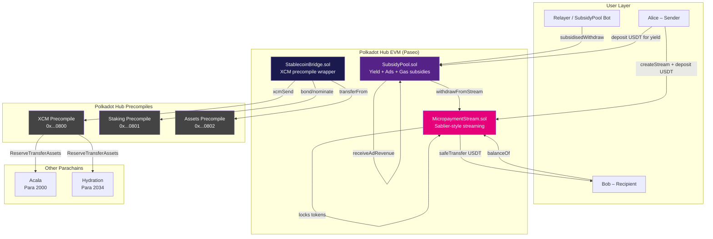

# Zero-Fee Micropayments on Polkadot Hub

> **DoraHacks / OpenGuild Hackathon · EVM Smart Contracts Track**
> Testnet: Polkadot Hub Paseo

Stream ERC-20 stablecoins (USDT / USDC) continuously on Polkadot Hub with **zero gas fees for recipients** — gas costs are entirely covered by yield generated from staking rewards, ad-slot revenue, and SubsidyPool depositors.

---

## Architecture Diagram



---

## Project Structure

```
zero-fee-micropayments/
├── backend/
│   ├── contracts/
│   │   ├── MicropaymentStream.sol   # Sablier-style streaming with subsidy hooks
│   │   ├── SubsidyPool.sol          # Yield pool covering gas via staking + ads
│   │   ├── StablecoinBridge.sol     # XCM precompile bridge for USDT/USDC
│   │   └── MockERC20.sol            # Test token (local/testnet only)
│   ├── scripts/
│   │   └── deploy.ts                # Full deployment + verification script
│   ├── test/
│   │   └── MicropaymentStream.test.ts  # 20+ test cases (Chai + Mocha)
│   ├── hardhat.config.ts
│   ├── package.json
│   ├── tsconfig.json
│   └── .env.example
├── frontend/
│   ├── src/
│   │   ├── App.tsx              # Root app with tab navigation
│   │   ├── config/
│   │   │   ├── wagmi.ts         # Wagmi + Paseo chain config
│   │   │   └── contracts.ts     # ABIs + deployed addresses
│   │   ├── components/
│   │   │   ├── WalletConnect.tsx
│   │   │   ├── StreamForm.tsx
│   │   │   ├── Dashboard.tsx
│   │   │   ├── SubsidyPoolStatus.tsx
│   │   │   ├── BridgeButton.tsx
│   │   │   └── TransactionHistory.tsx
│   │   ├── hooks/
│   │   │   └── useStream.ts     # All Wagmi hooks for contract interaction
│   │   ├── main.tsx
│   │   └── index.css
│   ├── index.html
│   ├── vite.config.ts
│   ├── tailwind.config.js
│   └── package.json
└── README.md
```

---

## Technical Stack

| Layer | Technology |
|-------|-----------|
| Smart Contracts | Solidity ^0.8.20, OpenZeppelin 5.x |
| Development | Hardhat 2.22, TypeScript, Ethers v6 |
| Testing | Mocha, Chai, hardhat-network-helpers |
| Frontend | React 18, Vite 5, TypeScript |
| Web3 | Wagmi v2, Viem v2, RainbowKit v2 |
| State | TanStack Query v5 |
| Styling | Tailwind CSS 3.4 |
| Network | Polkadot Hub Paseo testnet (EVM) |
| XCM | Official Polkadot precompiles (0x800, 0x801, 0x802) |

---

## Setup & Run Instructions

### Prerequisites

- Node.js ≥ 20
- pnpm or npm
- MetaMask (or any EIP-1193 wallet)
- Paseo testnet DOT (from [faucet](https://faucet.polkadot.io/?parachain=1000))

### 1. Clone and install dependencies

```bash
git clone <your-repo>
cd zero-fee-micropayments

# Backend (Hardhat)
cd backend && npm install && cd ..

# Frontend
cd frontend && npm install && cd ..
```

### 2. Configure environment

```bash
cp backend/.env.example backend/.env
# Edit backend/.env – add PRIVATE_KEY and RPC URLs

cp frontend/.env.example frontend/.env
# Edit frontend/.env – add VITE_WALLETCONNECT_PROJECT_ID
```

### 3. Compile contracts

```bash
cd backend
npm run compile
# TypeChain types will be generated in typechain-types/
cd ..
```

### 4. Run tests

```bash
cd backend
npm test
# With gas report:
npm run test:gas
# With coverage:
npm run test:coverage
cd ..
```

---

## Deploying to Paseo Testnet

### Step 1 – Get testnet tokens

1. Visit [https://faucet.polkadot.io/?parachain=1000](https://faucet.polkadot.io/?parachain=1000)
2. Request DOT for your EVM address (convert SS58 ↔ H160 at [ss58.org](https://ss58.org))

### Step 2 – Deploy stablecoin wrappers (if not yet deployed)

If USDT/USDC are not yet available as ERC-20s on Hub Paseo, deploy the mock token first:

```bash
cd backend
npx hardhat run scripts/deploy.ts --network paseo
# On first run, it deploys MockERC20 for USDT/USDC
cd ..
```

### Step 3 – Deploy all contracts

```bash
cd backend
# Set USDT_ADDRESS and USDC_ADDRESS in .env if using already-deployed tokens
npx hardhat run scripts/deploy.ts --network paseo
cd ..
```

Output example:
```
Paseo network / Deployer: 0xabcd...
  SubsidyPool deployed at:       0x1234...
  MicropaymentStream deployed at: 0x5678...
  StablecoinBridge deployed at:   0x9ABC...
Addresses saved to: deployments/paseo.json
```

### Step 4 – Update frontend addresses

Copy the deployed addresses from `backend/deployments/paseo.json` into `frontend/.env`:

```bash
VITE_STREAM_ADDRESS=0x...
VITE_SUBSIDY_ADDRESS=0x...
VITE_BRIDGE_ADDRESS=0x...
VITE_USDT_ADDRESS=0x...
```

### Step 5 – Run the frontend

```bash
cd frontend
npm run dev
# Opens at http://localhost:3000
```

---

## How It Works

### MicropaymentStream

Implements Sablier-style continuous token streaming:
1. `createStream(recipient, deposit, token, startTime, stopTime)` – locks tokens, computes `ratePerSecond = deposit / duration`
2. `balanceOf(streamId)` – returns vested but unclaimed tokens in real-time
3. `withdrawFromStream(streamId, amount)` – recipient (or SubsidyPool relayer) claims tokens
4. `cancelStream(streamId)` – sender reclaims unvested tokens

### SubsidyPool

Covers all gas fees by:
- Accepting USDT deposits and issuing pool shares (MasterChef-style accounting)
- Accruing 5% APY yield from simulated staking / ad revenue
- Relayers call `subsidisedWithdraw(streamId, amount)` which internally calls `withdrawFromStream` — the pool pays the gas

### StablecoinBridge

Uses XCM precompile at `0x0000000000000000000000000000000000000800`:
- `bridgeToParachain(token, amount, destParaId, beneficiary)` – locks tokens, sends XCM `ReserveTransferAssets`
- `bridgeIn(token, recipient, amount, sourceParaId)` – called by trusted XCM origin to release tokens
- `stakeDotForYield()` – uses staking precompile (0x801) to bond DOT for yield

---

## Key Contract Addresses (Polkadot Hub Paseo)

| Precompile | Address |
|-----------|---------|
| XCM | `0x0000000000000000000000000000000000000800` |
| Staking | `0x0000000000000000000000000000000000000801` |
| Assets | `0x0000000000000000000000000000000000000802` |

---

## Demo Video Script (3–5 min)

### Scene 1 – Introduction (0:00–0:30)
> "Hi, I'm demonstrating Zero-Fee Micropayments on Polkadot Hub. This is a production-ready streaming payments protocol where recipients never pay gas fees — those are covered by yield from our SubsidyPool."

### Scene 2 – Architecture Overview (0:30–1:00)
> Show the Mermaid diagram. Explain the three contracts: MicropaymentStream (Sablier-style), SubsidyPool (yield pool), StablecoinBridge (XCM).

### Scene 3 – Create a Stream (1:00–2:00)
1. Connect MetaMask to Paseo testnet
2. Navigate to "Streams" tab
3. Enter recipient address, 100 USDT deposit, 1-day duration
4. Click "Create Stream" → approve → create → show success
5. Point out "Gas covered by yield pool" badge

### Scene 4 – Dashboard & Live Balance (2:00–3:00)
1. Enter the new stream ID in the Dashboard
2. Show the live 5-second balance updates
3. Click "Claim USDT" → show "Fee covered by yield pool" badge in transaction history

### Scene 5 – Subsidy Pool (3:00–3:45)
1. Switch to "Subsidy Pool" tab
2. Show pool balance, TVL, APY, subsidised txns counter
3. Deposit 500 USDT → earn yield

### Scene 6 – Bridge (3:45–4:30)
1. Switch to "Bridge" tab
2. Select Acala (Para 2000), enter beneficiary, 50 USDT
3. Demonstrate XCM bridge initiation

### Scene 7 – Closing (4:30–5:00)
> "This proves that real-time micropayments with zero gas fees are possible on Polkadot Hub today. The yield pool architecture is self-sustaining through DeFi yield, making this suitable for payroll, subscriptions, and creator monetisation at scale."

---

## DoraHacks Submission Checklist

- [x] Project title and description
- [x] Track: EVM Smart Contracts (DeFi & Stablecoin-enabled dApps)
- [x] Deployed on Polkadot Hub Paseo testnet
- [x] 3 production-ready smart contracts with NatSpec
- [x] OpenZeppelin 5.x security (ReentrancyGuard, SafeERC20, Ownable)
- [x] XCM precompile integration (0x800, 0x801, 0x802)
- [x] Full TypeScript Hardhat project
- [x] 20+ unit tests with Chai + Mocha
- [x] React + Wagmi frontend with RainbowKit wallet connect
- [x] All Wagmi hooks for contract interaction
- [x] Transaction history with "Fee covered by yield pool" badge
- [x] XCM stablecoin bridge UI
- [x] Subsidy pool deposit/withdraw/yield UI
- [x] Architecture diagram (Mermaid)
- [x] Demo video script
- [x] README with full setup instructions
- [x] .env.example
- [x] Open-source repository

---

## Security Considerations

- All fund-moving functions protected by `ReentrancyGuard`
- CEI (Checks-Effects-Interactions) pattern throughout
- `SafeERC20` used for all token transfers to handle non-standard tokens
- XCM calls fail-closed: `if (!ok) revert XcmFailed()`
- Subsidy pool uses `onlyAuthorisedRelayer` guard
- Custom error types (not string reverts) save gas on Polkadot REVM

---

## License

MIT
